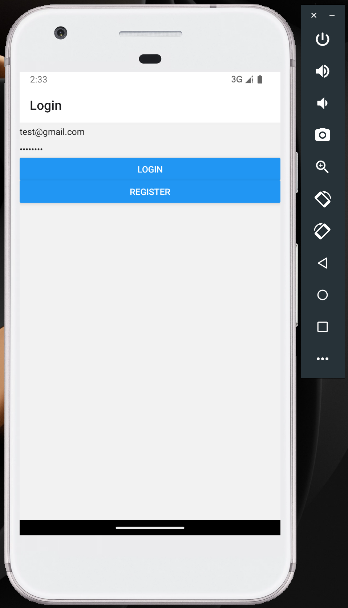

# React Native To-Do App

This is a full-stack To-Do application built using React Native for the frontend and Node.js with TypeScript for the backend. The app includes session-based authorization and is compatible with Android, web, and iOS platforms.

## Installation

### Prerequisites

- Node.js (>= 14.x)
- npm (>= 6.x) or yarn (>= 1.x)
- MongoDB
- Android Studio (for Android emulator)
- Xcode (for iOS development on macOS)
- Expo CLI

### Clone the Repository

```sh
git clone https://github.com/ZJonnathan/react-native-todo-app.git
```

### Setup backend
On terminal 
```sh
cd backend
npm install
npx ts-node-dev src/server.ts
```

you should see something like this

```sh
user@User-MacBook-Pro backend % npx ts-node-dev src/server.ts
[INFO] 14:29:23 ts-node-dev ver. 2.0.0 (using ts-node ver. 10.9.2, typescript ver. 5.5.4)
Server is running on port 3000
Connected to MongoDB
```

If so, MongoDB is running successfully

### Setup frontend
On terminal
```sh
cd frontend
npm install
npm start
```

you should see something like this

```sh
user@User-MacBook-Pro frontend % npm start

> frontend@1.0.0 start
> expo start

Starting project at /xx/xx/xx/react-native-test/frontend
Starting Metro Bundler
▄▄▄▄▄▄▄▄▄▄▄▄▄▄▄▄▄▄▄▄▄▄▄▄▄▄▄
█ ▄▄▄▄▄ █▀█ █▄█▄▀██ ▄▄▄▄▄ █
█ █   █ █▀▀▀█ ▀▄█▄█ █   █ █
█ █▄▄▄█ █▀ █▀▀▀▄▀██ █▄▄▄█ █
█▄▄▄▄▄▄▄█▄▀ ▀▄█▄▀▄█▄▄▄▄▄▄▄█
█ ▄▄  █▄▄ ▄▀▄▀ ▀█▄▄█▄█ █ ██
█▀ ▄ ██▄███▄█▀█▀ ▄▄██▄ █▄ █
█▀███ █▄  ▄▄█▄ ▀▄▄▀▄▄▄▀ ▀██
█ █ ▄█▄▄ ▄█▀ ▄▄█▄▀▀ ▄▀ ▄  █
█▄█████▄▄ ▀▄▄  ▀▀ ▄▄▄ ▄ ▄▄█
█ ▄▄▄▄▄ █▄ ██▀██▀ █▄█ ▀▄  █
█ █   █ █ ▀ ▀▀▄▀ ▄▄   ▄ ▀▀█
█ █▄▄▄█ █   █ ██▄  ▀▀█▀▄█ █
█▄▄▄▄▄▄▄█▄▄█▄█▄█▄██████▄▄▄█

› Metro waiting on exp://192.168.18.129:8081
› Scan the QR code above with Expo Go (Android) or the Camera app (iOS)

› Web is waiting on http://localhost:8081

› Using Expo Go
› Press s │ switch to development build

› Press a │ open Android
› Press i │ open iOS simulator
› Press w │ open web

› Press j │ open debugger
› Press r │ reload app
› Press m │ toggle menu
› Press o │ open project code in your editor

› Press ? │ show all commands

Logs for your project will appear below.
```

